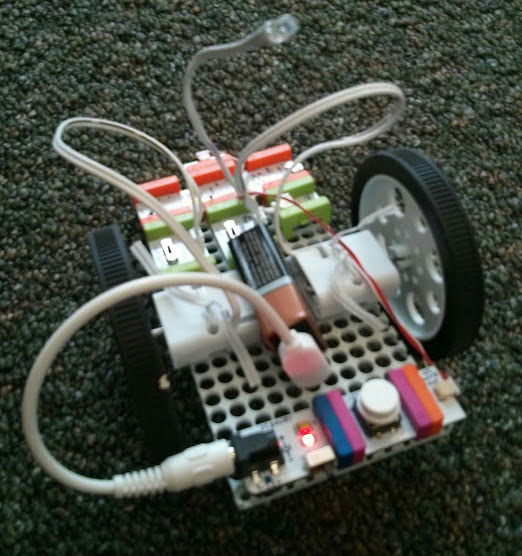

# MazeRunner
A library for controlling a LittleBits Arduino car

I created this for a [Girls Code Lincoln](https://girlscodelincoln.com) (formerly Lincoln Girls Who Code) Club. It provides a simple interface to command a programmable car.

## The Car


A [Steam Student Set](https://shop.littlebits.cc/products/steam-student-set) contains all the parts necessary to build the car with the addition of an [Arduino Bit](https://shop.littlebits.cc/products/arduino-bit).

- x1 [Mounting Board](https://littlebits.cc/blackboard)
- x1 [Battery + Cable](https://shop.littlebits.cc/products/battery-plus-cable)
- x1 [Power](https://shop.littlebits.cc/products/littlebits-power)
- x1 [Button](https://shop.littlebits.cc/products/button)
- x1 [Wire](https://shop.littlebits.cc/products/wire-bit)
- x1 [Arduino](https://shop.littlebits.cc/products/arduino-bit)
- x2 [DC Motor (Tethered)](https://shop.littlebits.cc/products/dc-motor-tethered)
- x2 Wheel
- x1 [Long LED (optional)](https://shop.littlebits.cc/products/long-led)

For more annoying fun, replace the long LED with a [Buzzer](https://shop.littlebits.cc/products/buzzer) to make a car horn.

## Available Commands

```cpp
car.speed = 127;          //Set the speed (values from 1 to 127)
car.stop();               //Stop the car
car.forward(1000);        //Drive forward for 1 second and then stop
car.backward(2000);       //Drive backward for 2 seconds and then stop
car.turnLeft(1000);       //Turn left for 1 second
car.turnRight(9000);      //Turn right for 9 second
car.zeroPointLeft(500);   //Turn left sharply for ½ second
car.zeroPointRight(1000); //Turn right sharply for 1 second
car.lightOn();            //Turn the light on
car.lightOff();           //Turn the light off
```
